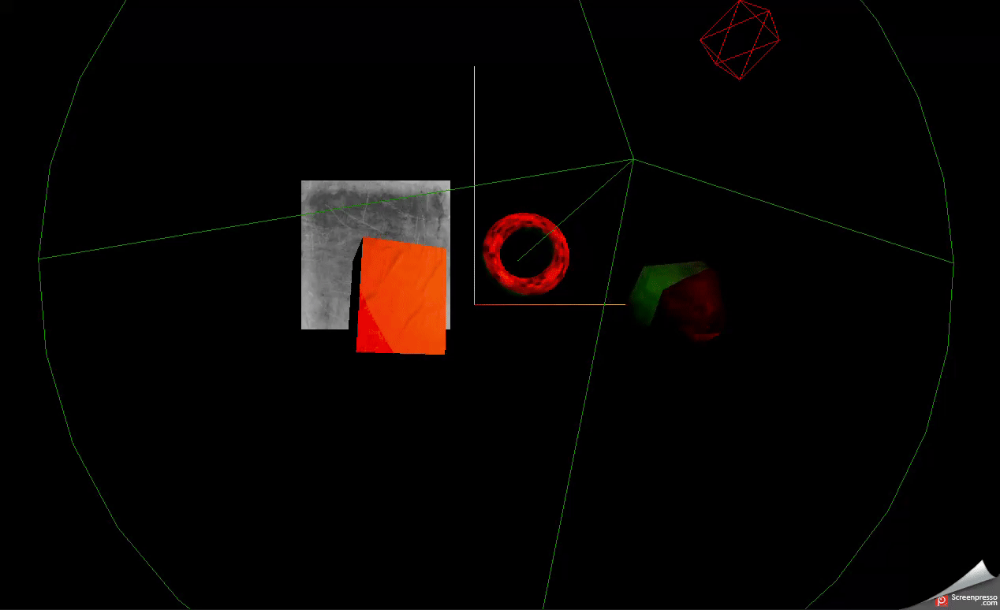
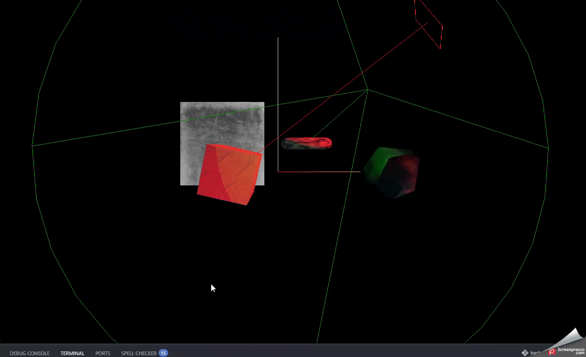
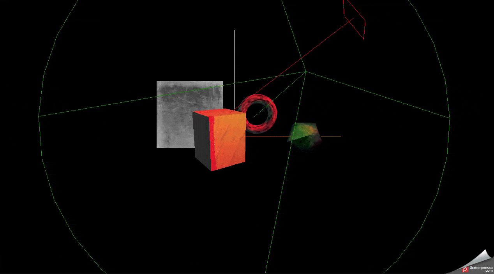

# Three.JS — практичний курс

Навчальний проєкт для вивчення [Three.js](https://threejs.org/) — бібліотеки для
роботи з 3D-графікою у браузері поверх WebGL. Код пишеться покроково, кожен
коміт відповідає окремій темі курсу.

## Демо

### Світло



На анімації — сцена з трьома фігурами, що обертаються, та двома джерелами
світла. Червоне `DirectionalLight` імітує паралельні сонячні промені й освітлює
всю сцену з одного напрямку. Зелений `SpotLight` спрямований конусом на тор і
рухається разом з ним, бо його ціль прив'язана безпосередньо до об'єкта.
Каркасні хелпери показують, де саме розташовані лампи та куди вони світять, а
`AxesHelper` у центрі позначає осі координат: X — червона, Y — зелена, Z — синя.

### Камера та взаємодія



`OrbitControls` дає керувати камерою мишею — обертати сцену, наближати й
панорамувати, з інерцією та обмеженням дистанції. `Raycaster` кидає промінь з
камери в точку кліку й визначає, на яку фігуру потрапив курсор: перший клік
фарбує її, повторний повертає початковий колір.

### Анімація



Куб рухається по осях у нескінченному циклі `yoyo`, сфера летить еліптичною
орбітою через анімацію кута й тригонометрію в `onUpdate`, а тор плавно
масштабується при наведенні курсора.

## Стек

- **Three.js** `^0.185.1` — рендеринг сцени
- **GSAP** `^3.15.0` — анімації
- **Vite** `^8.2.2` — dev-сервер і збірка

## Що реалізовано

**Основа сцени** — `Scene`, `PerspectiveCamera`, `WebGLRenderer` та цикл
рендерингу через `requestAnimationFrame`.

**Геометрія** — куб (`BoxGeometry`), сфера (`SphereGeometry`), тор
(`TorusGeometry`) і площина (`PlaneGeometry`) з незалежними анімаціями
обертання.

**Матеріали** — порівняння `MeshBasicMaterial` (ігнорує світло),
`MeshPhongMaterial` (дає відблиск через `shininess`) та `MeshStandardMaterial`
(фізично коректна модель). Текстури підвантажуються через `TextureLoader` з
`public/img/`.

**Освітлення** — `AmbientLight`, `PointLight`, `DirectionalLight` і `SpotLight`
з налаштуванням `angle`, `penumbra`, `distance` та `decay`. Для `SpotLight`
показано два способи задати напрямок: через координати `target.position` і через
прив'язку `target` до існуючого об'єкта сцени.

**Камера** — `OrbitControls` з `enableDamping`, `screenSpacePanning` та межами
наближення `minDistance` / `maxDistance`.

**Взаємодія** — `Raycaster` для вибору об'єктів кліком і підсвічування при
наведенні. Екранні координати переводяться у нормалізовані координати пристрою,
промінь перевіряється лише проти списку клікабельних фігур, а початковий колір
зберігається в `userData`, щоб повторний клік повертав його назад.

**Анімація** — GSAP для руху куба (`yoyo`, `repeat: -1`), еліптичної орбіти
сфери через `onUpdate` і масштабування тора при наведенні. Рейкастинг виконується
у кожному кадрі, бо камера й самі об'єкти рухаються постійно.

**Хелпери** — `AxesHelper`, `DirectionalLightHelper`, `SpotLightHelper`,
`PointLightHelper` для візуального налагодження.

## Запуск

```bash
npm install
```

```bash
npm run dev
```

Проєкт відкриється на `http://localhost:5173/`.

Збірка у продакшн:

```bash
npm run build
```

## Структура

```
├── css/
│   └── style.css
├── public/
│   └── img/          # текстури та демо-матеріали
├── index.html
├── index.js          # вся логіка сцени
└── package.json
```
