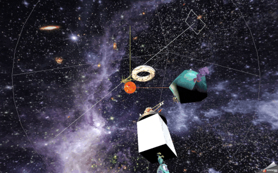

# Three.JS — практичний курс

Навчальний проєкт для вивчення [Three.js](https://threejs.org/) — бібліотеки для
роботи з 3D-графікою у браузері поверх WebGL. Код пишеться покроково, кожен
коміт відповідає окремій темі курсу.

## Демо

### Світло


На анімації — сцена з трьома фігурами, що обертаються, та двома джерелами
світла. Червоне `DirectionalLight` імітує паралельні сонячні промені й освітлює
всю сцену з одного напрямку. Зелений `SpotLight` спрямований конусом на тор і
рухається разом з ним, бо його ціль прив'язана безпосередньо до об'єкта.
Каркасні хелпери показують, де саме розташовані лампи та куди вони світять, а
`AxesHelper` у центрі позначає осі координат: X — червона, Y — зелена, Z — синя.

### Камера та взаємодія


`OrbitControls` дає керувати камерою мишею — обертати сцену, наближати й
панорамувати, з інерцією та обмеженням дистанції. `Raycaster` кидає промінь з
камери в точку кліку й визначає, на яку фігуру потрапив курсор: перший клік
фарбує її, повторний повертає початковий колір.

### Анімація


Куб рухається по осях у нескінченному циклі `yoyo`, сфера летить еліптичною
орбітою через анімацію кута й тригонометрію в `onUpdate`, а тор плавно
масштабується при наведенні курсора.

### 3D-моделі



Моделі у форматі GLTF підвантажуються через `GLTFLoader` і прив'язуються до фігур
як дочірні об'єкти, тому рухаються разом з ними. Сонце стоїть у центрі координат
і обертається навколо власної осі, нахиленої на 7.25°.

## Стек

- **Three.js** `^0.185.1` — рендеринг сцени
- **GSAP** `^3.15.0` — анімації
- **Vite** `^8.2.2` — dev-сервер і збірка

## Що реалізовано

**Основа сцени** — `Scene`, `PerspectiveCamera`, `WebGLRenderer` та цикл
рендерингу через `requestAnimationFrame`.

**Геометрія** — куб (`BoxGeometry`), сфера (`SphereGeometry`), тор
(`TorusGeometry`) і площина (`PlaneGeometry`) з незалежними анімаціями
обертання.

**Матеріали** — порівняння `MeshBasicMaterial` (ігнорує світло),
`MeshPhongMaterial` (дає відблиск через `shininess`) та `MeshStandardMaterial`
(фізично коректна модель). Текстури підвантажуються через `TextureLoader` з
`public/img/`.

**Освітлення** — `AmbientLight`, `PointLight`, `DirectionalLight` і `SpotLight`
з налаштуванням `angle`, `penumbra`, `distance` та `decay`. Для `SpotLight`
показано два способи задати напрямок: через координати `target.position` і через
прив'язку `target` до існуючого об'єкта сцени.

**Камера** — `OrbitControls` з `enableDamping`, `screenSpacePanning` та межами
наближення `minDistance` / `maxDistance`.

**Взаємодія** — `Raycaster` для вибору об'єктів кліком і підсвічування при
наведенні. Екранні координати переводяться у нормалізовані координати пристрою,
промінь перевіряється лише проти списку клікабельних фігур, а початковий колір
зберігається в `userData`, щоб повторний клік повертав його назад.

**Анімація** — GSAP для руху куба (`yoyo`, `repeat: -1`), еліптичної орбіти
сфери через `onUpdate` і масштабування тора при наведенні. Рейкастинг виконується
у кожному кадрі, бо камера й самі об'єкти рухаються постійно.

**3D-моделі** — завантаження GLTF через `GLTFLoader`, прив'язка моделей до фігур
через ієрархію об'єктів, вимірювання габаритів через `Box3` для точного
розміщення на поверхні.

**Хелпери** — `AxesHelper`, `DirectionalLightHelper`, `SpotLightHelper`,
`PointLightHelper` для візуального налагодження.

## Запуск

```bash
npm install
```

```bash
npm run dev
```

Проєкт відкриється на `http://localhost:5173/`.

Збірка у продакшн:

```bash
npm run build
```

## 3D-моделі та ліцензії

Моделі завантажені зі [Sketchfab](https://sketchfab.com/):

| Модель | Автор | Ліцензія |
|---|---|---|
| [A Massive Alien Brute](https://sketchfab.com/3d-models/a-massive-alien-brute-ac6294f21a9949cdbdb93fe0080e51a7) | [ScyBTC](https://sketchfab.com/ScyBTC) | Sketchfab Standard |
| [Alien Quadpod](https://sketchfab.com/3d-models/alien-quadpod-972c52b2f3dc4dd29967a59afe0d212b) | [uday](https://sketchfab.com/udayjeet) | Sketchfab Standard |
| [Fish mouther](https://sketchfab.com/3d-models/fish-mouther-60004c231e38445b91153abb75a077db) | [Khadka Niyash](https://sketchfab.com/niyash) | CC BY 4.0 |
| [Green Alien Character](https://sketchfab.com/3d-models/green-alien-character-19d9469531fa419a8a426c1338359477) | [assetfactory](https://sketchfab.com/assetfactory) | Sketchfab Standard |
| [Small alien 3d model](https://sketchfab.com/3d-models/small-alien-3d-model-e3c1f9ff036745e693fa1e734e1aefe2) | [vishnuvardhan](https://sketchfab.com/surampudivishnuvardhan) | Sketchfab Standard |
| [Sun and solar flares](https://sketchfab.com/3d-models/sun-and-solar-flares-39953f8a89f84d97905b79887e748536) | [Chaitanya Krishnan](https://sketchfab.com/chaitanyak) | Sketchfab Standard |

Обов'язкове зазначення для моделі під CC BY 4.0:

> This work is based on "Fish mouther"
> (https://sketchfab.com/3d-models/fish-mouther-60004c231e38445b91153abb75a077db)
> by Khadka Niyash (https://sketchfab.com/niyash) licensed under CC-BY-4.0
> (http://creativecommons.org/licenses/by/4.0/)

Повні тексти ліцензій лежать у `license.txt` поряд з кожною моделлю.

## Структура

```
├── css/
│   └── style.css
├── public/
│   └── img/          # текстури та демо-матеріали
├── index.html
├── index.js          # вся логіка сцени
└── package.json
```
